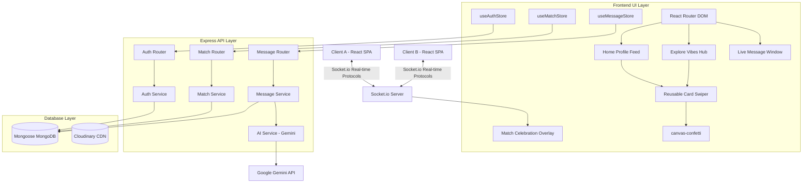

# Swipe: Premium Tinder Clone

Swipe is a state-of-the-art, premium, and feature-rich Tinder clone designed for high-fidelity interactive swiping, smart AI matchmaking, and real-time social networking. 

---

## ⚡ Technical Architecture & Data Flow



---

## ✨ Features Offered

### 1. 🧠 AI-Powered Icebreaker Generator (Gemini Integration)
* **Description**: Never worry about what to say first. Analyze matching profiles dynamically to generate three personalized, charming conversation starters.
* **Tech**: Integrates Google Gemini API (`gemini-1.5-flash`) via the `@google/generative-ai` SDK, with contextual fallback algorithms when offline or API keys are absent.

### 2. ⭐ "Super Like" with Particles & Glow Effects
* **Description**: Express high interest with a premium swipe action. Highlights you in the target user's swipe deck with glowing gold/cyan borders and a "SUPER LIKED YOU! ⭐" badge.
* **Tech**: Framer Motion gestures, canvas-confetti particle bursts, and persistent MongoDB tracking schemas.

### 3. 🎉 Real-time Socket Match Celebrations
* **Description**: Receive mutual match overlays instantly. Freezes the viewport with a dark glassmorphic overlay, slides mutual avatars together, streams floating hearts, and offers an direct chat bar.
* **Tech**: Real-time Socket.io pushes synchronized between online client sessions.

### 4. 🧭 Interest-Based Explore Hub
* **Description**: Step out of the generic queue and find people matching your exact interests (e.g. *Gaming, Coding, Food, Travel*).
* **Tech**: SOLID Private match filters, dynamic gradient styling, and highly modular `CardSwiper` extractions.

### 5. 💬 Instant Messaging & Live Notifications
* **Description**: Text-based chatting with online presence indicators (active now / offline) and real-time message notifications using toast prompts.
* **Tech**: Zustand state channels, Socket.io subscriptions, and Mongoose indexing.

---

## 🛠️ Getting Started

### Prerequisites
* Node.js (v18+)
* MongoDB Instance

### Server Setup (backend)
1. Navigate to `/backend`
2. Create a `.env` file containing:
   ```env
   PORT=3001
   MONGO_URI=your_mongodb_connection_string
   JWT_SECRET=your_jwt_secret
   CLOUDINARY_CLOUD_NAME=your_cloudinary_name
   CLOUDINARY_API_KEY=your_cloudinary_key
   CLOUDINARY_API_SECRET=your_cloudinary_secret
   GEMINI_API_KEY=your_google_gemini_key
   ```
3. Run `npm install`
4. Start dev server: `npm run dev`

### Client Setup (frontend)
1. Navigate to `/frontend`
2. Create a `.env` file containing:
   ```env
   VITE_API_URL=http://localhost:3001
   ```
3. Run `npm install`
4. Start client dev server: `npm run dev`
